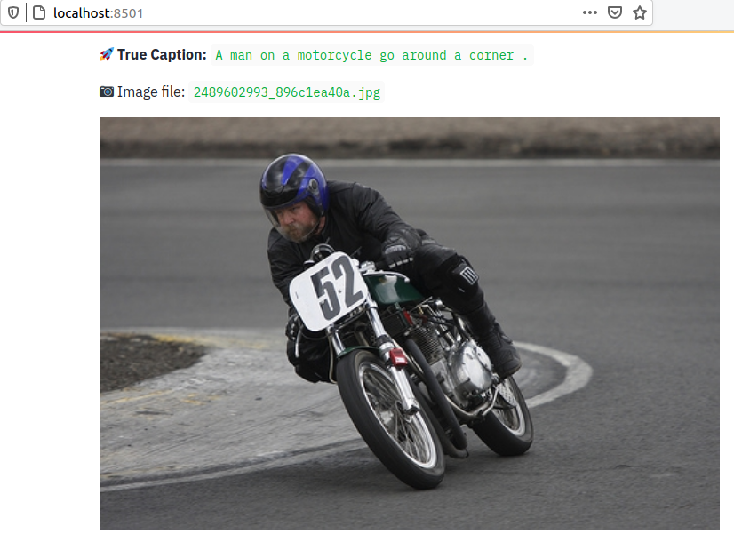

# :camera: :bookmark_tabs: Image Captioning

`Image Caption Generation` is a challenging task where a textual description is generated given a picture. It needs both methods from Computer Vision and Natural Language Processing to connect the image feature with words in the right order. 

Several papers, blogs, github-codes, articles are already available. However the aim of this repository is to build the same as a learning exercise. Therefore, even if some initial concpets and guidelines are taken from some blogs (referenced later), but the applied dataset, model architecture, code structure is completely written from scratch. 

In many blogs, the author has used the COCO or similar large dataset, which is difficult to process in personal laptop. So I have used Flickr dataset, relatively smaller, available in Kaggle. 

Apart from the main code, there are lots of helper code, which were needed as the code is developed/debugged in local laptop and pushed to GPU machine to run on full dataset. And finally the models, vocab files and performance plots are saved in Kaggle dataset for future utilization.


## Usage

:pushpin: For running all the pieces of this repository, a `Makefile` and `config.yaml` is provided. Please refer to it. All the file locations, hyper-parameters are provided using the config file. Set them properly.

:pushpin: For quick prototyping, logic validation, silent/non-silent bug fixing, you can run the code in `DEV_MODE`. Set it to `True` in config file. This will run the code with smaller number of datasets to test the pipeline end-to-end. Once you are satisfied, set it to `False` to train and predict on full dataset. 

Many helper functions are given in the makefile, which may not be needed directly. They were needed for setting up the project in GPU machine in a (semi)-automatic fashion using all those helper methods. But to make things easier, let me explain how to execute the main pieces of this repo.

### :floppy_disk: Dataset

- [Flickr8K dataset](https://www.kaggle.com/shadabhussain/flickr8k)

### :broom: Data Cleaning


```py
make clean-data
```

This will generate a processed caption file (`.csv`). This filepath needs to be set in config file under the key `CAPTION_FILE`. This file will be used while training the model. 

### :chart_with_upwards_trend: Data Validation

For quick data validation run the below line at the terminal from project parent directory

```py
make datavalidation
```

This will create a simple [streamlit](https://www.streamlit.io/) **data-app** in the browser. Set the `slider`  and check differnt `image sample` and corresponding `caption`



### :rocket: Train Model

- Set hyperparameter in the config file.

```py
make train
```

- **Output:** Vocab file and models are saved under `model/` directory.


### :rocket: Predict

1. To predict on the whole test dataset, run

```py
make predict
```

This returns a csv file like this which helps to understand the prediction quiality

| IMAGE_ID | TRUE_CAPTION | PRED_CAPTION | BLEU_SCORE | COSINE_SIMILARITY |
|-|-|-|-|-|
| `461505235_590102a5bf.jpg` | A man be climb up a rock | A man be climb a rock | 0.7913 | 1.0 |
| `3375070563_3c290a7991.jpg` | A large white bird fly over water | A white bird fly over water | 0.7913 | 0.9258 |
| `3064383768_f6838f57da.jpg` | A man surf a wave | A man in a wetsuit be surf on a wave | 0.4045 | 0.9129 |
| `150387174_24825cf871.jpg` | A man be ride a dirt bike over some rock | A man ride a bike down a dirt path | 0.4371 | 0.8571 |

1. To predict on single image please use the Notebook 

- [ ] _add inference notebook_ [TODO]

### :lock: Track experiment

This is an iterative work and needs mutiple experiment to finetune the result. Therefore it's better to user `experiment tracker`.   

- This project uses [comet ml](https://www.comet.ml/site/)

----

## Learning

The `decoder` part is tricky. Initially the `nn.LSTM()` [[link](https://pytorch.org/docs/stable/generated/torch.nn.LSTM.html#torch.nn.LSTM)] was used, which actually trains in bulk, i.e small `nn.LSTMCell()` [[link](https://pytorch.org/docs/stable/generated/torch.nn.LSTMCell.html#torch.nn.LSTMCell)] [blue boxes in the below image] are `stacked` based on cofiguration. This was causing issues during prediction.

Somehow, couldn't follow how does `nn.LSTM()` make sure that `hidden_sate` and `cell_sate` 
at time `t-1` are fed at next time step `t`, i.e, the recurrent behavior. May be it can be done using the `nn.LSTM()` module, but was unable to do it. So, during the initial training days, the output captions were not making senses. 

**LSTM Implementation in PyTorch**


This [blog](https://medium.com/@stepanulyanin/captioning-images-with-pytorch-bc592e5fd1a3) helps to understand the nuances of decoder in a clear manner and helps to understand how to use `nn.LSTMCell()`.

So in the updated Decoder, `nn.LSTMCell()` [blue boxes] is used, which acts as a single RNN cell - building block of `nn.LSTM()` module. This gives better control over the decoder - helps in debugging as well. Captions are generated using `nn.LSTMCell()` in a loop and predicted captions start to make sense finally. Using `nn.LSTMCell()` is like using one blue box at a time. 

Great learning !!

### How to interpret the pytorch LSTM module?

It really depends on a model you use and how you will interpret the model. Output may be:

- a single LSTM cell hidden state
- several LSTM cell hidden states
- all the hidden states outputs

Output, is _almost never interpreted directly_. If the input is encoded there should be a `softmax layer` to decode the results.

Note: In language modeling hidden states are used to define the probability of the next word, p(wt+1|w1,...,wt) =softmax(Wht+b).


**Reference:**
 
- [blog](https://towardsdatascience.com/automatic-image-captioning-with-cnn-rnn-aae3cd442d83)
- [Github](https://github.com/Noob-can-Compile/Automatic-Image-Captioning)
- [Create Vocabulary in NLP tasks](https://www.kdnuggets.com/2019/11/create-vocabulary-nlp-tasks-python.html)
- [What's the difference between “hidden” and “output” in PyTorch LSTM?](https://stackoverflow.com/questions/48302810/whats-the-difference-between-hidden-and-output-in-pytorch-lstm) :fire:


----

### :dart: TODO:

While developing it, many things go wrong. And a systematic approach needs to be followed to tackle it precisely. Here goes what's done and what needs to be done. 

1. [x] Create DataSet and DataLoader
   1. [x] Create Image Transform
2. [x] Create Network
   1. [x] Create Encoder
   2. [x] Create Decoder
      1. [x] Check the LSTM syntaxt, pytorch documentation
3. [x] Optimizer
4. [x] Loss/objective function/criterion
5. [x] Add reproducibility
6. [x] Train model
   1. [ ] Callbacks
      1. [x] Learning rate scheduler, ..plateaue
      2. [x] Saving best model
7. [ ] **Performance Evaluation**
   1. [x] Add Sentence level **BLEU score** to compare true captions and predicted captions. [link](https://machinelearningmastery.com/calculate-bleu-score-for-text-python/)
   2. [ ] [METEOR Score](https://www.nltk.org/api/nltk.translate.html) Metric for Evaluation of Translation with Explicit ORdering:  
   3. [ ] [CIDEr](http://vrama91.github.io/cider/) (Consensus-based Image Description Evaluation): Used as a measurement for image caption quality
   4. [x] Add sentence similarity score between `true_caption` and `pred_caption`
8. [x] Prediction
9. [ ] **Model Debugging** :fire:
   1. Paper to follow:
      1. [Learning cnn lstm architecture for image caption generation Moses Soh](http://cs224d.stanford.edu/reports/msoh.pdf)
         1. [x] As per the paper, 2 LSTM 
         2. [x] with [droupout](https://blog.floydhub.com/long-short-term-memory-from-zero-to-hero-with-pytorch/) (keep probability 0.75) work best for MSCOCO dataset
   2. [Coping with Overfitting Problems of Image Caption](https://dacemirror.sci-hub.tw/proceedings-article/6c77b0141a839ab70bfd7c69ed07c4f8/luo2019.pdf?rand=5f218af6655f8?download=true)
   3. [x] Debug Overfitting
   4. [x] :fire: **Debug Decoder:** It seems the main issue is the decoder. This [blog](https://medium.com/@stepanulyanin/captioning-images-with-pytorch-bc592e5fd1a3) helped a lot to understand the nuances properly. And finally meaningful captions started to generate.
   5. [x] Vary Learning Rate ([pytorch learning rate scheduler](https://pytorch.org/docs/stable/optim.html#how-to-adjust-learning-rate))
   6. [ ] When to use `softmax()` and relation with loss function
   7. [ ] Vary batch sampler/data loader
   8. [ ] Vary batch size
   9. [x] Add more LSTM layers in the Decoder 
      1. [x] Try Bi-directional, but final decoder uses single layer LSTM
   1.  [x] Add dropout layer
   2.  [ ] Add [word embedding](https://medium.com/@martinpella/how-to-use-pre-trained-word-embeddings-in-pytorch-71ca59249f76)
   3.  [x] Check training `input` + `label` order
10. [x] Experiment tracker
11. [ ] Serving/ Simple web UI
12. [ ] Docker
13. [ ] Deployment (Heroku)

----

:santa: :rocket: _Happy Coding !!_

-----------